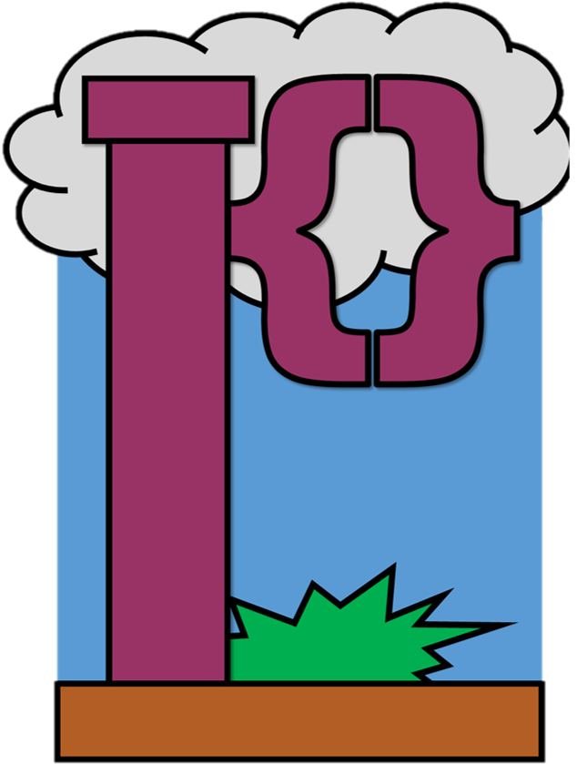

<p align="center">
  
</p>

# Plumb
This language is focused on making it easier to focus on and interact with the "pipelines" that emerge in our workflows. Sometimes it is hard to follow how to follow how other's code operates and by giving our programs a more visually directed structure, we can more easily parse each other's work! Plumb can also be recognized as quite rigid in its structure. By requiring more work into how a program must be written in the language, it provides visual indicators in all programs that can be relied on when readings others' work. For instance, unlike the language Plumb will be compared to, Plumb requires "boilerplate" due to it requiring a definitions and pipeline section to be initialized. In short, an empty page is not a valid Plumb program. The major feature of this langauge is the visualization and ease of multi-threading and parallelization. The pipelines section of a plumb program is meant not to be read in the traditional top-down, line by line fashion. It specifies parallel streams, hence pipelines, of actions to be done side by side. A pipe is a single left-to-right line of instructions in the pipelines section and is meant to be executed from left o right by following the arrow heads. The idea is that you would organize operations that do not inherently rely on one another in new pipes to allow for parallelization.

## Language Overview
- Statically and Strongly Typed
- Visually Rigid for Ease of Readability
- Strong parallel operation support

Below is an in-depth view of Plumb with a comparison to equivalent code in JavaScript

## Built-in Overview

### Keywords
|Keyword|Description|
|-------|-----------|
|Definitons||
|Pipelines||
|return||
|if||
|else||
|for||
|while||

### Primitive Types
|Type|Values|JavaScript|
|----|------|----------|
|Does not exist `DNE`|`empty`|Null `null`|
|Boolean `BOOL`|`true`, `false`|Boolean `true` `false`|
|Integers `INT`|` `|BigInt ` `|
|Rationals `RAT`|` `|Number ` `|
|String `STR`|` `|String ` `|
|Function `FUNC`|` `|Object\function ` `|
|Prototype `PROTO`|` `|Class ` `|

### Binary Operators
|Operator|Symbol|Avaliable Types|
|--------|------|---------------|
|Addition|`+`|Integers, Rationals, String|
|Subtraction|`-`|Integers, Rationals|
|Multplication|`*`|Integers, Rationals, String|
|Division|`/`|Integers, Rationals|
|Modulus|`%`|Integers, Rationals|
|Less Than|`<`|Integers, Rationals|
|Less Than or equal|`<=`|Integers, Rationals|
|Greater Than|`>`|Integers, Rationals|
|Greater Than or equal|`>=`|Integers, Rationals|
|Equality|`==`|Boolean, Integers, Rationals|
|Inequality|`!=`|Boolean, Integers, Rationals|
|Logical AND|`and`|Boolean|
|Logical OR|`or`|Boolean|

Note: Prototypes can use the operator (`OP`) key word to adapt functionality

### Unary Operators
|Operator|Symbol|Avaliable Types|
|----|------|----------|
|Negation|`!`|Boolean|
|Negation|`-`|Integers, Rationals|
|Incrementation|`++`|Integers|
|Decrementation|`--`|Integers|

Note: Prototypes can use the operator (`OP`) key word to adapt functionality

### Pipeline Operators
|Operator|Syntax|Description|
|----|------|----------|
|Injection|a, b, c, ... `-->` target|Takes an arbitrary number of parameters on the left and pushes them into the next operation on a pipe|
|Drain|Prototype `-#->` target|Similar to dot notation, takes a object and takes a copy of the specified attribute "#" and pushes it into the next operation on a pipe|

<table>
    <tr> <th> Plumb </th> <th> JavaScript </th> <tr>
    <tr> 
        <td>
            ``` 
            Defintions {
                INT a = 7+2-(-3+4)
                INT b = 8*4
                RAT c = 7/2
                STR d = "ka"
                STR FUNC e (f) {
                    return f + "boom"
                }
                PROTO G {
                    ATR STR h
                    G(x){
                        self.h = h
                    }
                }
                G i = G("this is a good sentence")
            }
            Pipelines {
                a, b, c --> print
                d --> e --> print
                i -h-> print 
            }
            ```
        </td> 
        <td>
            ```javascript
            var a = 7+2-(-3+4)
            var b = 8*4
            var c = 7/2
            var d = "ka"
            function e (f) {
                return f + "boom"
            }
            class G {
                h
                constructor(x){
                    this.h = x
                }
            }
            i = new G("this is a good sentence")
            console.log(a, b, c)
            console.log(e(d))
            console.log(i.h)
            ```
        </td>
    <tr>
</table>

## Plumb vs JavaScript Examples

#### Default Program
Plumb
```
Definitions {}
Pipelines {}
```
Javascript
```
```

#### Hello World!
Plumb
```
Definitions {
    STR x <-- "Hello World!"
}
Pipelines {
    x --> print
}
```
JavaScript
```
console.log("Hello World!")
```