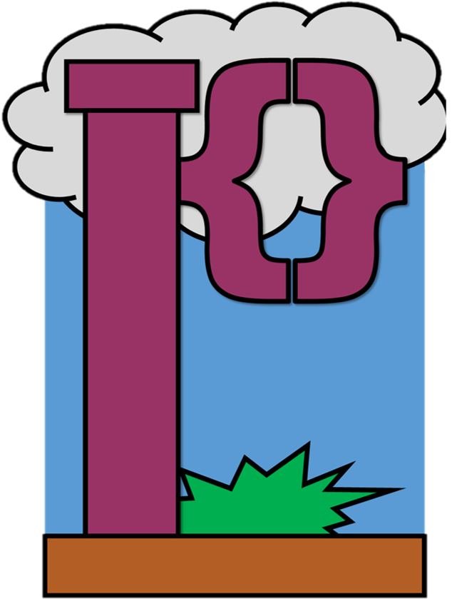

<p align="center">
  
</p>

# Plumb
This language is focused on making it easier to focus on and interact with the "pipelines" that emerge in our workflows. Sometimes it is hard to follow how to follow how other's code operates and by giving our programs a more visually directed structure, we can more easily parse each other's work! Plumb can also be recognized as quite rigid in its structure. By requiring more work into how a program must be written in the language, it provides visual indicators in all programs that can be relied on when readings others' work. For instance, unlike the language Plumb will be compared to, Plumb requires "boilerplate" due to it requiring a definitions and pipeline section to be initialized. In short, an empty page is not a valid Plumb program. The major feature of this langauge is the visualization and ease of multi-threading and parallelization. The pipelines section of a plumb program is meant not to be read in the traditional top-down, line by line fashion. It specifies parallel streams, hence pipelines, of actions to be done side by side. A pipe is a single left-to-right line of instructions in the pipelines section and is meant to be executed from left o right by following the arrow heads. The idea is that you would organize operations that do not inherently rely on one another in new pipes to allow for parallelization.

## Language Overview
- Statically and Strongly Typed
- Visually Rigid for Ease of Readability
- Strong parallel operation support

## 5 Example Programs
```
::
This is a small program that takes inputs off the command line, capitilizes them, and prints them
::
Definitions {
    STR FUNC capitilize(STR word) {
        return STR.uppercase(word)
    }
}
Pipelines {
    INPUT --<( -(STR)-> capitilize --> print
}
```
```
::
This program makes use of the "factory" operator to quickly create parallel pipes for
preforming arithmetic over an array of rationals
::
Definitions {
    ||RAT|| to_be_divided <== || 23.7, 8.0, 983, 74.07, 96.6, 12.983 ||
    RAT FUNC divide_by_3(RAT x) {
        return x / 3
    }
}
Pipelines {
    to_be_divided --<( --> divide_by_3 --> print
}
```
```
::
This program prints successive powers of a specified base up to some limit pulled from the commandline arguments
::
Definitions {
    INT FUNC powers(INT base, INT limit) {
        INT value <== 1
        while(value <= limit){
            print(value)
            value <** base
        }
    }
}
Pipelines {
    INPUT, INPUT -1-2-> -(INT)-> powers
}
```
```
:: 
This program takes an input off the commandline, casts it to an INT type,
and denominates it into the smallest number of US coins.
::
Definitions {
    ||INT|| FUNC denominate(INT total) {
        INT current_total <== total
        INT quarters <== current_total % 25
        current_total <-- 25 * quarters
        INT dimes <== current_total % 10
        current_total <-- 10 * dimes
        INT nickels <== total % 5
        current_total <-- 5 * nickels
        return ||quarters, dimes, nickels, current_total||
    }
}
Pipelines {
    INPUT -1-> -(INT)-> denominate --> print
}
```
```
::
This program takes an input word off the commandline and stretches it
proportional to its character length
::
Definitions {
    STR FUNC stretched(STR word) {
        INT counter <== 0
        STR stretched_word <== ""
        while(counter < STR.c_length(word)) {
            stretched_word + (word[counter]*(counter+1))
            counter <++ 1
        }
        return stretched_word
    } 
}
Pipelines {
    INPUT -1-> -(STR)-> stretched --> print
}
```
